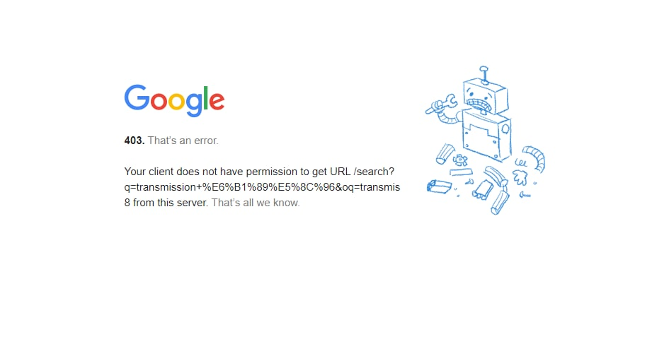

# 问题

gigsgigscloud美西GIA从昨天开始以**154.3**开头的某段ip使用谷歌搜索后会出现403界面。



因我们在【魔法上网】的过程中使用谷歌搜索的频率非常之高，故在此给出一种利用[HE](https://tunnelbroker.net/)免费提供的免费ipv6隧道来绑定我们使用的vps，从而实现谷歌搜索可以正常使用。当然这种方法并非丝毫没有坏处，我们选择同为洛杉矶的ipv6机器配置，经测试ping仍然高达80余ms,但基本解决该段谷歌搜索无法使用的问题，下面给出具体的配置方法。

# 解决方法

**环境： Centos 7**

## 1. 进入网址：

[IPv6 Tunnel Broker](https://tunnelbroker.net/)


在左上角箭头所指的位置先注册账号，注册成功后登录。

登录后界面：


ps： 注意箭头位置，下一步配置隧道。

## 2. 建立与vps绑定的隧道

点击如上一幅图所示的 `Create Rugular Tunnel`:


在箭头1所指的位置输入你的vps **ipv4地址；**

箭头2的位置为指定ipv6地址对应的地区，这儿我们选 Los Angeles就好，但是延迟并不想一个城市那么低，晚上6点的时候大概有73ms左右的延迟：


下翻到最底部创建ipv6:


创建成功后：


选择红色箭头所指向的 **Eaxmple Configurations:**


选择你的 OS这儿选择**Linux-route2:**


复制上图中箭头所指位置的全部命令，粘贴到vps中执行；


执行完成后，开启vps的ipv6.

## 3. 开启ipv6

编辑/etc/sysctl.conf文件

`vi /etc/sysctl.conf`


在末尾追加：

```bash
net.ipv6.conf.all.disable_ipv6 = 0
net.ipv6.conf.default.disable_ipv6 = 0
net.ipv6.conf.lo.disable_ipv6 = 0
```

启用ipv6:

`sysctl -p`

这时候就大功告成，可以使用下面命令ping一下一个ipv6网址试一下：

`ping6 ipv6.google.com`


**perfect**

谷歌搜索可以正常使用了：


## Debian

Debian系统可尝试下面的方法，本人没有实验，讲道理应该也是可行的

[使用HE的tunnelbroker IPv6隧道为阿里云等国内VPS增加IPv6支持-教程-凤梨酥](https://fengli.su/archives/tunnelbroker-ipv6-aliyun.html)

## 参考资料

[Centos 7配置tunnelbroker隧道支持IPv6访问](https://www.liuheng.xin/4581.html)
